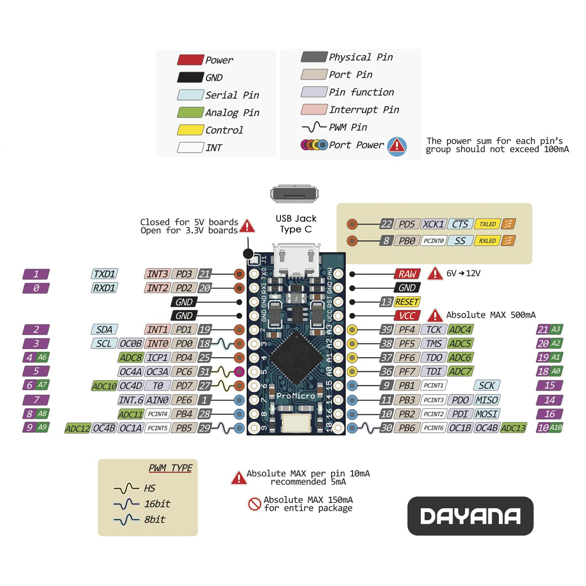

# arduino-gear-shift
6 Speed + Reverse + Sequential gear shifter code for an arduino.

Based on a Dayana ATmega32U4 running at 5V/16MHz, USB-C.

# Requirements
- Must have a board which has native USB support. ATmega32U4 provides this.
- 9 SPDT switches. 
  - 6 drive gears
  - 1 reverse
  - 1 Up shift for the sequential
  - 1 Down shift for the sequential
- ArduinoJoystickLibrary: Included the libary here for convience

# Steps:
1. Connect each gear switch's positive wire to the corresponding digital input pin. All the respective gears and their pins are in the code. 
   - e.g. Gear 3 connects to pin 2.
2. Connect each gear switch's negative wire to a ground pin (GND).